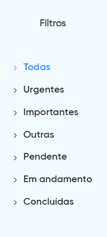

# Controle de Tarefas .NET
Este projeto requer .NET versão 6.0 ou superior e Node.js versão 16.16.0. Os instaladores podem ser baixados nos seguintes links:
- .NET 6.0: [https://dotnet.microsoft.com/pt-br/download/dotnet/6.0](https://dotnet.microsoft.com/pt-br/download/dotnet/6.0)
- Node.js 16.16.0: [https://nodejs.org/en/blog/release/v16.16.0](https://nodejs.org/en/blog/release/v16.16.0)

## Configuração do Back-End

1. **Localize o diretório do projeto back-end**: Navegue até `caminho\para\seu\diretório\backend\SistemaControleDeTarefas\ControleDeTarefas`.

2. **Configuração do banco de dados**:
   - Abra o arquivo `appsettings.json` com um editor de texto de sua preferência.
   - Localize a seção `ConnectionStrings` e edite os valores conforme necessário:
     ```json
     {
       "Logging": {
         "LogLevel": {
           "Default": "Information",
           "Microsoft.AspNetCore": "Warning"
         }
       },
       "ConnectionStrings": {
         "DataBase": "Server=./;DataBase=DB_ControleTarefas;DataSource=DATA_SOURCE;UserId=YOUR_USER_ID;Password=YOUR_PASSWORD"
       },
       "AllowedHosts": "*"
     }
     ```
   - Substitua `DATA_SOURCE`, `YOUR_USER_ID` e `YOUR_PASSWORD` pelos seus respectivos dados de acesso ao SQL Server.

Salve o arquivo após realizar as alterações.

## Executando o Back-End

1. **Navegação até o diretório do projeto**:
   - Abra o Command Prompt (CMD).
   - Navegue até o diretório onde o projeto está localizado. Se você clonou ou baixou o projeto em seu diretório de usuário, por exemplo, você pode usar um comando como este:
     ```
     cd caminho\para\seu\diretório\backend\SistemaControleDeTarefas\ControleDeTarefas
     ```
   - Substitua `caminho\para\seu\diretório` pelo caminho específico onde o diretório do projeto se encontra em seu computador.


2. **Construa o projeto**:
   - Execute o comando abaixo para construir o projeto:
     ```
     dotnet build
     ```

3. **Execute a aplicação**:
   - Após a construção, inicie a aplicação com o comando:
     ```
     dotnet run
     ```
   - Se tudo estiver configurado corretamente, a aplicação estará disponível na porta 5135.

4. **Acesse o Swagger**:
   - Para visualizar a documentação da API e testar os endpoints, acesse:
     [http://localhost:5135/swagger/index.html](http://localhost:5135/swagger/index.html)

## Configurando e Executando o Front-End

1. **Navegação até o diretório do front-end**:
   - Abra o Command Prompt (CMD).
   - Navegue até o diretório onde o repositório foi instalado. Uma vez na pasta raiz, acesse o diretório do front-end com o comando:
     ```
     cd caminho\para\seu\diretório\frontvue
     ```
   - Substitua `caminho\para\seu\diretório` pelo caminho específico onde o diretório se encontra em seu computador.

2. **Instalação das dependências**:
   - No diretório do front-end, execute o seguinte comando para instalar todas as dependências necessárias:
     ```
     npm install
     ```

3. **Execução da aplicação**:
   - Após a instalação das dependências, inicie a aplicação com o comando:
     ```
     npm run serve
     ```
   - Aguarde até que a aplicação seja compilada e iniciada.

4. **Acesso à aplicação**:
   - Uma vez que a aplicação esteja rodando, você pode acessá-la pelo navegador na URL:
     [http://localhost:8080/](http://localhost:8080/)

## Tutorial de Uso

Aqui estão as instruções básicas para utilizar o sistema de controle de tarefas:

- **Criar uma nova tarefa**: Clique no botão verde com o símbolo "+" localizado no canto inferior direito da tela.
- **Editar uma tarefa**: Clique no ícone de lápis encontrado ao lado de cada tarefa no grid para fazer alterações.
- **Deletar uma tarefa**: Clique no ícone de lixeira ao lado da tarefa que deseja remover.
- **Pesquisar tarefas**: Utilize o campo de pesquisa abaixo do título "Minhas Tarefas" para filtrar tarefas por título ou descrição.
- **Ordenar tarefas**: Clique nos cabeçalhos das colunas no grid para ordenar as tarefas de forma ascendente ou descendente.
- **Filtrar tarefas por categoria ou status**: Selecione uma das opções (Todas, Urgentes, Importantes, Outras) próximas ao título "Minhas Tarefas" para filtrar as tarefas conforme a categoria ou status desejado.

## Imagens do Sistema



